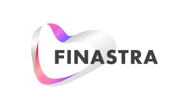
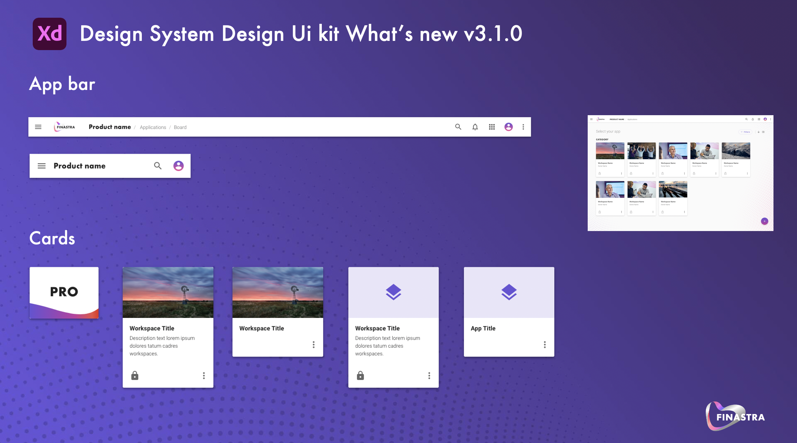
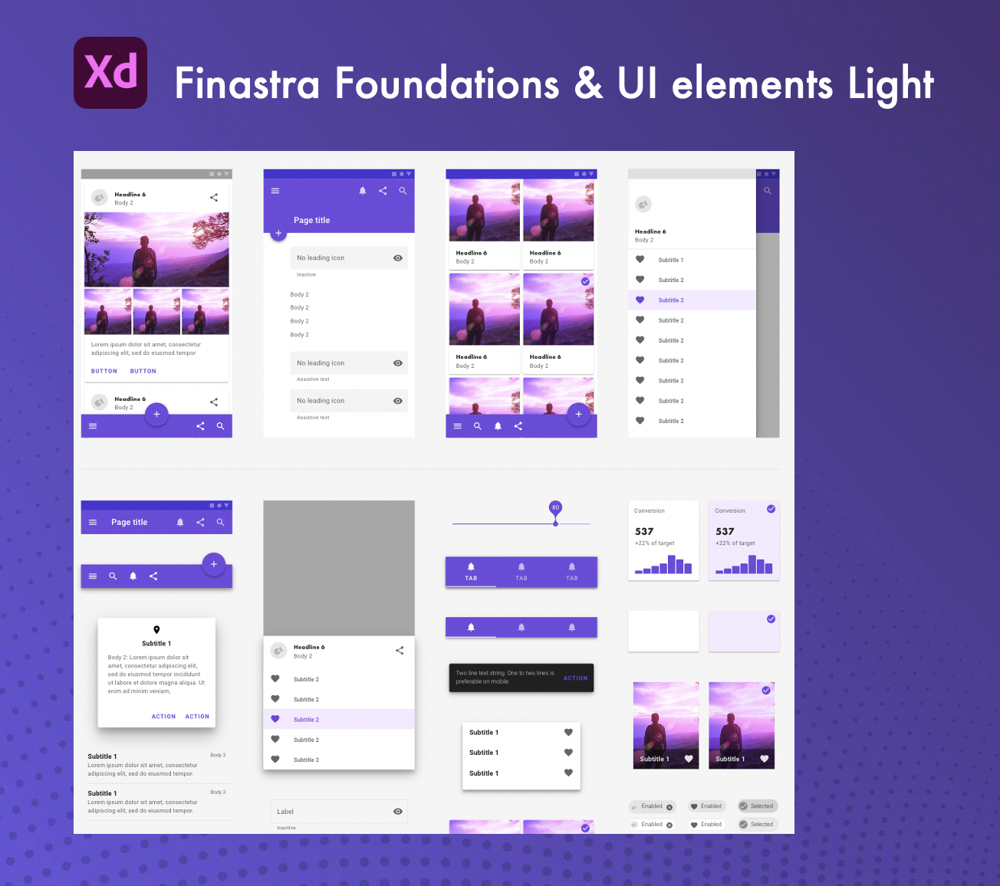

# **Finastra Design Kit**
# **UI Library (v 3.4.0)**

## What’s new?

Version 3.4
**Login page Adobe XD file** 
- XD file available with updated assets 

**Global navigation Adobe XD files** 
- Solution homepage XD file available 
- Applications homepage XD file available

Version 3.3
**Adobe XD Finastra Foundations - Light** 
- Text Fields with label / Added dense version for all text fields
- Text Fields with label / Fix missing label in all activated state
- Text Fields with label / Added a “read only” state to match some user requirements 
- Typography styles / Switch back Subtitle family font from Roboto Bold to Roboto Medium

Version 3.2
**Adobe XD Finastra Foundations - Light** 

 [Added Finastra logo as vector asset.](https://github.com/fusionfabric/finastra-design-kit/blob/master/02%20-%20Create/01%20-%20UI%20Kit/01%20-%20Foundations/%5BLight%5D%20Finastra-Logo.xd)
 
 

Version 3.1

**Adobe XD Finastra components - Light** 

***Card components***
[Easily customizable card components: app card, product card, workspace card)](https://github.com/fusionfabric/finastra-design-kit/tree/master/02%20-%20Create/01%20-%20UI%20Kit/02%20-%20Components)

***App bar*** 
[Based on Finastra global navigation pattern, available for desktop and mobile, easy to customize and help you design consistent navigation)](https://github.com/fusionfabric/finastra-design-kit/tree/master/02%20-%20Create/01%20-%20UI%20Kit/02%20-%20Components)

Version 3.0

**Adobe XD UI kit - Foundations and UI elements - Light** 
[Finastra branded material UI elements and Finastra foundations in Adobe XD.)](https://github.com/fusionfabric/finastra-design-kit/tree/master/02%20-%20Create/01%20-%20UI%20Kit/01%20-%20Foundations)

Version 2.12

**Use case / Account Services Dashboard Sketch** 
- Provide Sketch dashboard template for Account Services app

Version 2.11

**Create / User flows**
- Release an XD version of the user flows with additional patterns (checkout, dashboard, master-detail)

Version 2.10

**Pattern / Smart Assistant**
- Adobe XD source file available to download

Version 2.9

**Foundations / Colors**
- Add new Finastra Pink
- Update secondary colors
- Add and update gradients
- Update colors on borders

Version 2.8

**Use case / Trust Machine**
- Provide first version of XD file 

**Onboarding Kit for XD**
- Provide first version of XD file for Onboarding

Version 2.7

**Use case / Retail App for Adobe XD**
- Provide XD version of Sketch retail app kit

**New App Starter kit desktop for Adobe XD**
- Provide XD version of Sketch starter kit for desktop

Version 2.6

**New App Starter Mobile kit for Adobe XD**
- Improve user flow by making more interactions in Adobe XD file

Version 2.5

**New App Starter Sketch File for Mobile Version**
- A completed user flow from sign in to sign out 

**Foundation Improvement / Switch**
- Improve color contrast 

Version 2.4

**Improvement of Table component (Seperate file)**
- Add new examples of Table
- New symbols like sparkline , action , avatar and etc.
- More detailed explanations (usage guidelines).

**New Foundation / Toggle button**
- New toggle button : Icon
- New toggle button : Text
- New toggle button : Icon + Text.

Version 2.3

**New Component / Stepper added to Component Library**
- New stepper horizontal component coming with 2 main options (label-right and label bottom)
- New stepper vertical component
- Check the artboard preview in the sketch library to get a full overview of the component.

**New Component / Push Notifications added to Component Library**
- New Push Notification component coming with various options (basic, info, success, warning, error)
- Check the artboard preview in the sketch library to get a full overview of the component.

**Accessibility fixes**
- Improving accessibility for dense chip text to make AA compliant.

Version 2.2

**New Component Improvement / Menu**
- Prebuild "5 items menus" insertable symbols with various options:
  - Text
  - Icon
  - Circle Icon
  - Circle Image
  - Thumbnail
- "Menus" (location, currency, dashboards, languages, API...), "Select Text Field + Menu" and "Textfield + Menu Autocomplete" samples accessibles in sketch from "Material Components page"and also from "Symbols menu / Menu / Demo / ...

**New Component Improvement / List**
- Component extended with more options (Circle Icon, Body 2 Titles...)
- Symbols renaming to be more clear ;)

**New Beta Component / Stepper**
- New stepper horizontal component coming with 2 main options (label-right and label bottom)
- This beta version is available to test in the "Design System / Design assets / 03-Contribute" folder.

Version 2.1

**New Component Improvement / Textfields**
- Finastra Branded: Style has been updated to match Finastra identity (colors and fonts).
- New size: dense size available for all textfields.
- Label display option: you can insert any textfield with or without label.
- Extended types : prefix and suffix have been implemented.
- Success State
- Single Style: We decided to keep only one text field family : the filled one (with background).

**New Component / Text Area**
- The brother of the Textfields are now available and come also with 2 sizes and “label or not” option.

**New Pattern / Checkout Form**
- Simple Checkout Form that exposes various textfields sketch elements 
(with leading icon, select, with helper text...) with the Finastra look & feel ;) 

Version 2.0

**New Library / Charts**
- Adapted from “Lstore Graphics”, brand new library with lots of charts, graphs and diagrams
Still in progress ;)

**New Component / Filter**
- Sketch menu path : 02 – Finastra Components Light / Finastra / Component / Filter

**Foundations / Chips Improvement**
- Sketch menu path : 01 – Finastra Foundations Light / Chips
- New version of chips (including 3 different sizes, different content, close option)

**Foundations / New Typography**
- Subtitle 3 and Body 3

**Icon Library / Improvement**
- You can now assign color to icons from any palette (Material or Finastra)

**Foundations / New Media Card**
- Sketch menu path : 01 – Finastra Foundations Light / Cards / Media
- New card for Media and Video (including gradient overlay, play icon, new dedicated title block)
  - Cards / Media / Standard / Resting
  - Cards / Media / 16:9 / Dense / With Title / Resting
  - Cards / Media / 16:9 / Dense / No Title / Resting

**Foundations / New atom Stacked Avatar**
- Sketch menu path : 01 – Finastra Foundations Light / Avatar / Stacked
  - Avatar / Stacked / 24px
  - Avatar / Stacked / 48px

**Components / New Workspace Card**
- Sketch menu path : 02 – Finastra Components Light / Finastra / Component / Card / Workspace
- New card for workspace including : (including gradient overlay, and dedicated status)
  - Finastra / Component / Card / Workspace / Dense / Resting
  - Finastra / Component / Card / Workspace / Standard / Resting

**Components / New Product Card**
- Sketch menu path : 02 – Finastra Components Light / Finastra / Component / Card / Product / Acronym /
- New card for product :
  - Finastra / Component / Card / Product / Acronym / 4:3 Extra Dense / Resting
  - Finastra / Component / Card / Product / Acronym / 4:3 Dense / Resting
  - Finastra / Component / Card / Product / Acronym / 4:3 Standard / Resting
  - Finastra / Component / Card / Product / Acronym / 4:3 Large / Resting

## What's fixed or improved?
#### Version 2.0.2
**App Bar**
- Overlapping bug with product name and breadcrumb has been fixed.

#### Version 2.0.1
**Buttons label descendants truncated**
- Text symbol used in buttons have been updated to avoid some text being truncated.

## What’s next?
- Single color palette
- … and more ;)

Enjoy ;)

UXG 
